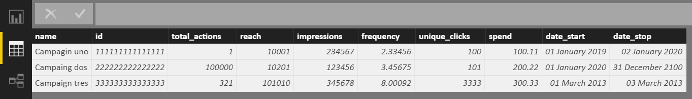

# FacebooksAds PowerBI data connector
PwerBI data connector for FacevookAds

## Quickstart
This module uses the extensibility provided by [Data Connectors](https://github.com/Microsoft/DataConnectors), so in order to use it you have to:
1. Create a `[My Documents]\Microsoft Power BI Desktop\Custom Connectors` directory
2. Enable the **Custom data connectors** preview feature in Power BI Desktop (under *File | Options and settings | Custom data connectors*)
3. Copy the the *.mez file from `/build` folder into the above folder
4. Restart Power BI Desktop

## For developers 
In order to extend the modules 
1. Install the [Power Query SDK](https://aka.ms/powerquerysdk) from the Visual Studio Marketplace
2. Edit the existing `Data Connector Project` or *.pq files 
3. Build the solution
The deployable *.mez files will be located in the Debug folder of each module under `/src`. The Relese configuration of the build will copy these files into the `/build` folder.

# Functions
For additional examples and documentation please refer to the embeded documentation of each of the functions.
## FacebookAds.Campaign
A function that returns statistical insights related to the campaigns associated with connected user

`FacebookAds.Campaigns()`
### Output

## FacebookAds.API
Return a function which always returns a given value.

`FacebookAds.API(URI as URI.Type, params as record)`

Example
`FacebookAds.API("/me/adaccounts",[fields="name"])[data]{0}`

